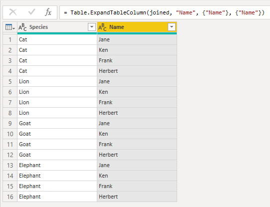

- [See more:](#see-more)
- [Ways to Loop](#ways-to-loop)
  - [`Table.AddColumn` with `ExpandTableColumn`](#tableaddcolumn-with-expandtablecolumn)
    - [Cross Product / Cartesian Joins](#cross-product--cartesian-joins)
  - [`For(x = 0; x < 5; x++) { ... }`](#forx--0-x--5-x---)
  - [`Do { Expression } while { Condition }`](#do--expression--while--condition-)
  - [`List.Accumulate` : Word wrap text that's an unknown length](#listaccumulate--word-wrap-text-thats-an-unknown-length)


## See more:

- `List.Dates()`, `List.DateTimes()`, `List.DateTimeZones()`
- `List.Times()`, `List.Durations()`, `List.Numbers()`
- `List.Accumulate()`, `List.Transform()`, `List.TransformMany()`

## Ways to Loop

There's many ways to loop, depending on what you need. Check out these functions:

- [List.Accumulate\(\)](https://docs.microsoft.com/en-us/powerquery-m/list-accumulate)
- [List.Transform\(\)](https://docs.microsoft.com/en-us/powerquery-m/list-transform)
- [List.Generate\(\)](https://docs.microsoft.com/en-us/powerquery-m/list-generate)

### `Table.AddColumn` with `ExpandTableColumn`

This `Table.AddColumn` method works well with **Web APIs**. Columns may be used to pass arguments to the request.

#### Cross Product / Cartesian Joins



```ts
let
    // TNames and TSpecies could use "enter data" or any table
    Names = {"Jane", "Ken", "Frank", "Herbert"},
    Species = {"Cat", "Lion", "Goat", "Elephant"},

    TSpecies = Table.FromList( Species, Splitter.SplitByNothing(),
        type table[Species = text], null, ExtraValues.Error),

    TNames = Table.FromList( Names, Splitter.SplitByNothing(),
        type table[Name = text], null, ExtraValues.Error),

    // creating a Cross-product / cartesian join of species X names
    joined = Table.AddColumn(
        TSpecies, "Name",           // source, Label
        (_) as table =>             // function with return type declared
            TNames,
        Value.Type(TNames)  // correct typing on 4th param means
    ),
    // the next step preserves the original column types on expansion, because of the 4th param
    FinalTale = Table.ExpandTableColumn(joined, "Name", {"Name"}, {"Name"})
in
    FinalTale
```

### `For(x = 0; x < 5; x++) { ... }`


Other Languages use a `for(init; compare; increment ) { expression }`
```js
for(x = 0; x < 5; x) {
  print(x)
}
```
```ts
// prints
0 1 2 3 4
```
A 1-line version
```ts
List.Generate(() => 0, each _ > 5, each _ + 1)
```
Same expression, written without `each` `sugar`
```ts
numbers = List.Generate(
    ()  => 0,       // initialize
    (x) => x < 5,   // test condition
    (x) => x + 1,   // increment/update
    (x) => x        // optional transform
)
```
Using the optional transform:
```ts
squares = List.Generate(
    ()  => 0,       // initialize
    (x) => x < 5,   // test condition
    (x) => x + 1,   // increment/update
    (x) => x * x    // optional transform
)
```

### `Do { Expression } while { Condition }`

Source: [Value.WaitFor\(\)](https://docs.microsoft.com/en-us/power-query/helperfunctions#valuewaitfor) from the custom connector docs
```ts
Value.WaitFor = (producer as function, interval as function, optional count as number) as any =>
  // This function is useful when making an asynchronous HTTP request and you need to poll the server until the request is complete.
    let
        list = List.Generate(
            () => {0, null},
            (state) => state{0} <> null and (count = null or state{0} < count),
            (state) => if state{1} <> null then {null, state{1}} else {1 + state{0}, Function.InvokeAfter(() => producer(state{0}), interval(state{0}))},
            (state) => state{1})
    in
        List.Last(list);
```

### `List.Accumulate` : Word wrap text that's an unknown length

```ts
let
    toggle_example = false,
    LoremIpsum = "Lorem ipsum dolor sit amet, consectetur adipiscing elit. Sed eu laoreet turpis. Curabitur lacinia, risus ut rhoncus mattis, turpis lorem iaculis justo, nec ultrices arcu erat vitae felis. Pellentesque vulputate efficitur scelerisque. Etiam bibendum dignissim mauris",

    // calculate length of string *after* the rightmost newline
    strNewline = "#(lf)",
    Text_LengthAfterNewline = (string as text) as number =>
        let
            posLastNewline = Text.PositionOf(string, strNewline, Occurrence.Last),
            posOffset = if posLastNewline <> -1 then posLastNewline else 0,
            deltaLen = Text.Length(string) - posOffset
        in
            deltaLen,

    // word wraps text
    Text_WordWrap = (string as text, max_width as number) as text =>
        let
            words = Text.Split(string, " "),
            accum_result = List.Accumulate(
                words, "",
                (state as text, current as text) as text =>
                    let
                        len = Text_LengthAfterNewline(state) + Text.Length(current) + 1,
                        maybeNewline =
                            if len > max_width then strNewline else "",

                        accum_string = Text.Combine({state & maybeNewline, current}, " ")
                    in
                        accum_string
            )
        in
            accum_result,

    wrapped_text = Text_WordWrap(LoremIpsum, 80)
in
    if toggle_example then wrapped_text else Text_WordWrap
```