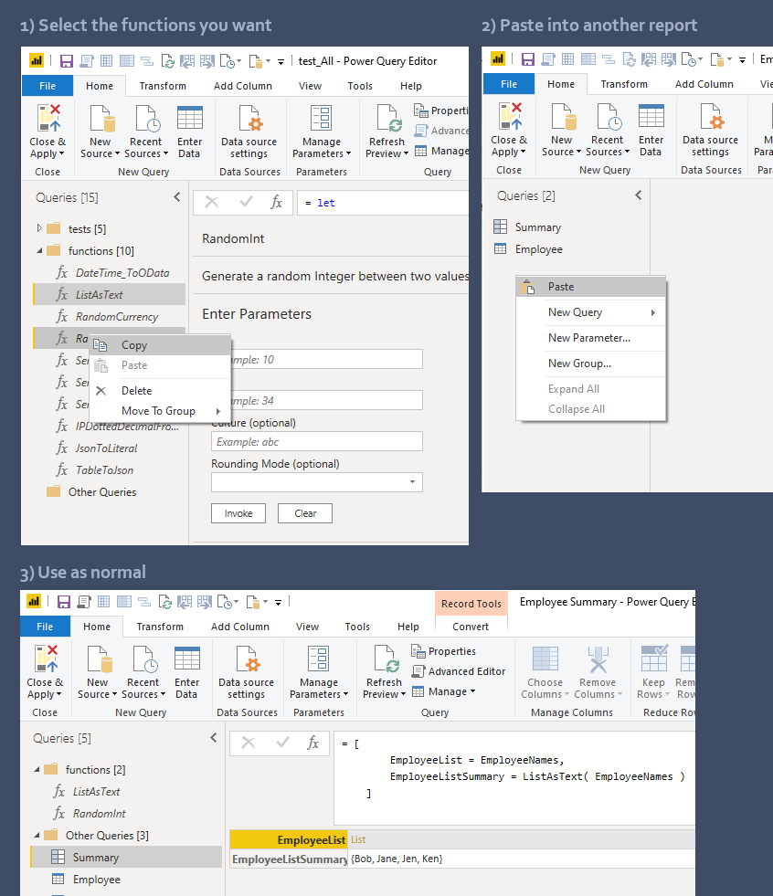
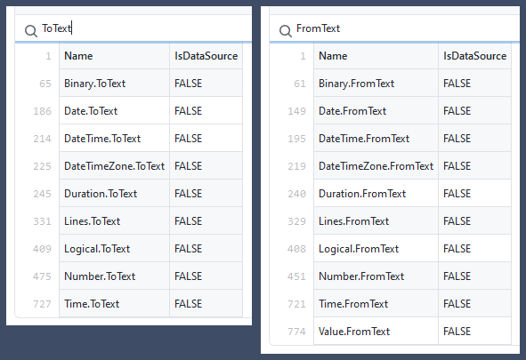

# Ninmonkey.PowerQueryLib

- [Ninmonkey.PowerQueryLib](#ninmonkeypowerquerylib)
  - [Special functions](#special-functions)
  - [Other links](#other-links)
  - [Usage](#usage)
  - [Language data](#language-data)

Custom functions for Power BI

## Special functions

- [Values](https://docs.microsoft.com/en-us/powerquery-m/value-functions) Functions
- [Type](https://docs.microsoft.com/en-us/powerquery-m/type-functions) Functions
- [Expression](https://docs.microsoft.com/en-us/powerquery-m/expression-functions) Functions
- [Comparer](https://docs.microsoft.com/en-us/powerquery-m/comparer-functions)
- [Function](https://docs.microsoft.com/en-us/powerquery-m/function-values)
- [`OAuth` Authentication](https://docs.microsoft.com/en-us/power-query/handlingauthentication)
  - first read: [blog.crossjoin Connecting To Rest APIs with OAuth2 in Power BI](https://blog.crossjoin.co.uk/2021/08/29/connecting-to-rest-apis-with-oauth2-authentication-in-power-query-power-bi/)
- [Windows Authentication and SSO](https://docs.microsoft.com/en-us/power-query/additional-connector-functionality)
- [Data Source Kind on SDK MS-DataConnectors](https://github.com/Microsoft/DataConnectors/blob/master/docs/m-extensions.md#data-source-kind)
- [Implementing `OAuth` Flow](https://github.com/Microsoft/DataConnectors/blob/master/docs/m-extensions.md#implementing-an-oauth-flow)
- [Implementing `Table.View` for Query Folding](https://github.com/microsoft/DataConnectors/blob/master/docs/table-view.md)
- [Implementing `Nav table`](https://github.com/microsoft/DataConnectors/blob/master/docs/nav-tables.md)
- [Extending the `ODBC` connector](https://github.com/microsoft/DataConnectors/blob/master/docs/odbc.md)
- example: [Swagger and two Auth types](https://github.com/microsoft/DataConnectors/blob/master/samples/DataWorldSwagger/DataWorldSwagger.pq)

## Other links

- [DataConnectors / samples](https://github.com/microsoft/DataConnectors/tree/master/samples)
- [Power Query Language Specs](https://docs.microsoft.com/en-us/powerquery-m/power-query-m-language-specification) (aka 'M')
- top level [Function Docs](https://docs.microsoft.com/en-us/powerquery-m/power-query-m-function-reference)
- Details on [Web.Contents: Special Behavior of HTTP Status Codes](https://github.com/microsoft/DataConnectors/blob/master/docs/other-topics.md)
- [Helper Functions](https://github.com/microsoft/DataConnectors/blob/master/docs/helper-functions.md) @microsoft/DataConnector
- [Main Trippin tutorial](https://github.com/microsoft/DataConnectors/tree/master/samples/TripPin)

## Usage

1. Open your report and open [test_All.pbix](source\test\test_All.pbix)
2. Select the functions you want (Any dependencies will be included for you)
3. Copy -> Paste

## Language data

- [All PowerQuery Functions](./Docs/List_Functions-All.csv)
- [All PowerQuery Constants](./Docs/List_Constants-All.csv)
- [All *.Types](./Docs/List_Types.csv)  This contains all built-in types like: `Int64.Type`, `Currency.Type`, etc.
